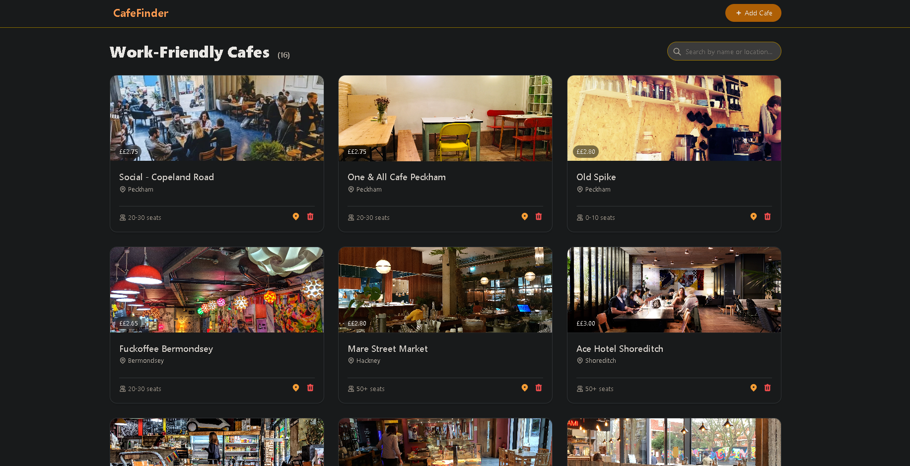

# Cafe Finder Website Documentation

## 1. Overview

The Cafe Finder website is a Flask-based web application that displays a list of cafes in London, with details about their amenities, location, seat capacity, and coffee price. Users can view all cafes, add new cafes via a form, and delete existing cafes. The site is styled with Tailwind CSS and features smooth animations for a polished user experience. All data is stored in an SQLite database (`cafes.db`).

## 2. Database Structure

The application uses a pre-existing SQLite database named `cafes.db`. It contains a single table `cafe` with the following columns:

| Column         | Type    | Description                                                                 |
|----------------|---------|-----------------------------------------------------------------------------|
| id             | INTEGER | Primary key, auto-incremented.                                              |
| name           | TEXT    | Name of the cafe.                                                           |
| map_url        | TEXT    | Google Maps URL for the cafe location.                                      |
| img_url        | TEXT    | URL of an image of the cafe.                                                |
| location       | TEXT    | Area or neighborhood in London (e.g., "Shoreditch", "Peckham").             |
| has_sockets    | TEXT    | Boolean-like value: "TRUE" or "FALSE" indicating availability of power sockets. |
| has_toilet     | TEXT    | "TRUE" or "FALSE" for toilet availability.                                  |
| has_wifi       | TEXT    | "TRUE" or "FALSE" for Wi-Fi availability.                                   |
| can_take_calls | TEXT    | "TRUE" or "FALSE" indicating whether taking phone calls is allowed.         |
| seats          | TEXT    | Seat capacity range (e.g., "0-10", "20-30", "50+").                         |
| coffee_price   | TEXT    | Price of a coffee stored as a string (e.g., "2.40").                        |

**Note:** Boolean values are stored as uppercase strings `"TRUE"` or `"FALSE"` rather than native boolean types. The `coffee_price` is stored as text to avoid decimal precision issues in SQLite.

## 3. Application Architecture

The application follows a typical Flask structure with modular components:

- **Flask** – web framework.
- **Flask-SQLAlchemy** – ORM for database interaction.
- **Flask-WTF** – form handling and CSRF protection.
- **Jinja2** – templating engine.
- **Tailwind CSS** (via CDN) – utility-first CSS framework for styling.
- **Custom CSS animations** – keyframe animations defined in the base template.

The project is organized as follows:

```
cafe_project/
├── app/
│   ├── __init__.py          # Flask app factory, db and csrf initialization
│   ├── models.py             # SQLAlchemy model for Cafe
│   ├── forms.py              # WTForms form for adding a cafe
│   ├── routes.py             # Blueprint with route definitions
│   └── templates/            # Jinja2 templates
│       ├── base.html         # Base template with navigation and flash messages
│       ├── index.html        # Homepage displaying all cafes
│       └── add.html          # Form page for adding a new cafe
├── instance/
│   └── cafes.db              # SQLite database (not committed to version control)
└── run.py                     # Application entry point
```

## 4. Detailed File Explanations

### 4.1 `app/__init__.py`

This file initializes the Flask application, sets up the SQLAlchemy database connection, and enables CSRF protection. It uses an **application factory pattern**:

```python
from flask import Flask
from flask_sqlalchemy import SQLAlchemy
from flask_wtf.csrf import CSRFProtect

db = SQLAlchemy()
csrf = CSRFProtect()

def create_app():
    app = Flask(__name__, instance_relative_config=True)
    app.config.from_mapping(
        SECRET_KEY='dev-secret-key-change-in-production',
        SQLALCHEMY_DATABASE_URI='sqlite:///cafes.db',
        SQLALCHEMY_TRACK_MODIFICATIONS=False
    )

    db.init_app(app)
    csrf.init_app(app)

    from .routes import main
    app.register_blueprint(main)

    return app
```

- The `SECRET_KEY` is used by Flask-WTF to sign CSRF tokens.
- `SQLALCHEMY_DATABASE_URI` points to the SQLite database file located in the `instance/` folder.
- The `main` blueprint (from `routes.py`) is registered to handle URL routes.

### 4.2 `app/models.py`

Defines the `Cafe` class which maps to the `cafe` table in the database:

```python
from . import db

class Cafe(db.Model):
    __tablename__ = 'cafe'

    id = db.Column(db.Integer, primary_key=True)
    name = db.Column(db.String(100), nullable=False)
    map_url = db.Column(db.String(200))
    img_url = db.Column(db.String(200))
    location = db.Column(db.String(100))
    has_sockets = db.Column(db.String(5))
    has_toilet = db.Column(db.String(5))
    has_wifi = db.Column(db.String(5))
    can_take_calls = db.Column(db.String(5))
    seats = db.Column(db.String(20))
    coffee_price = db.Column(db.String(10))
```

All columns are defined to match the database schema. Note that `coffee_price` is a string because the database stores it as text. This avoids type conversion errors when reading from the database.

### 4.3 `app/forms.py`

Uses Flask-WTF to create a form for adding a new cafe:

```python
from flask_wtf import FlaskForm
from wtforms import StringField, DecimalField, SelectField, BooleanField, SubmitField
from wtforms.validators import DataRequired, URL, Optional

class AddCafeForm(FlaskForm):
    name = StringField('Cafe Name', validators=[DataRequired()])
    map_url = StringField('Google Maps URL', validators=[URL(), Optional()])
    img_url = StringField('Image URL', validators=[URL(), Optional()])
    location = StringField('Location', validators=[DataRequired()])
    has_sockets = BooleanField('Has Sockets')
    has_toilet = BooleanField('Has Toilet')
    has_wifi = BooleanField('Has WiFi')
    can_take_calls = BooleanField('Can Take Calls')
    seats = SelectField('Seats', choices=[
        ('0-10', '0-10'), ('10-20', '10-20'), ('20-30', '20-30'),
        ('30-40', '30-40'), ('40-50', '40-50'), ('50+', '50+')
    ], validators=[DataRequired()])
    coffee_price = DecimalField('Coffee Price (£)', places=2, validators=[DataRequired()])
    submit = SubmitField('Add Cafe')
```

- `StringField` with `DataRequired` ensures the cafe name and location are provided.
- `URL()` validator checks that the map and image URLs are valid.
- Boolean fields map to checkboxes in the HTML; their data will be `True` or `False`.
- `SelectField` provides a dropdown for seat ranges.
- `DecimalField` ensures the price is a valid decimal number with two places.

### 4.4 `app/routes.py`

Contains all route handlers using a Blueprint named `main`:

#### Index Route (`/`)
```python
@main.route('/')
def index():
    cafes = Cafe.query.all()
    return render_template('index.html', cafes=cafes)
```
- Retrieves all cafe records from the database and passes them to the `index.html` template for display.

#### Add Cafe Route (`/add`)
- **GET** – displays the form.
- **POST** – processes the submitted form.

```python
@main.route('/add', methods=['GET', 'POST'])
def add_cafe():
    form = AddCafeForm()
    if form.validate_on_submit():
        try:
            new_cafe = Cafe(
                name=form.name.data,
                map_url=form.map_url.data,
                img_url=form.img_url.data,
                location=form.location.data,
                has_sockets='TRUE' if form.has_sockets.data else 'FALSE',
                has_toilet='TRUE' if form.has_toilet.data else 'FALSE',
                has_wifi='TRUE' if form.has_wifi.data else 'FALSE',
                can_take_calls='TRUE' if form.can_take_calls.data else 'FALSE',
                seats=form.seats.data,
                coffee_price=str(form.coffee_price.data)
            )
            db.session.add(new_cafe)
            db.session.commit()
            flash('Cafe added successfully!', 'success')
            return redirect(url_for('main.index'))
        except Exception as e:
            db.session.rollback()
            flash(f'Error adding cafe: {str(e)}', 'error')
    else:
        for field, errors in form.errors.items():
            for error in errors:
                label = getattr(form, field).label.text
                flash(f'Error in {label}: {error}', 'error')
    return render_template('add.html', form=form)
```

- `validate_on_submit()` checks if the request is POST and if all validators pass.
- Boolean fields from the form are converted to `"TRUE"`/`"FALSE"` strings.
- `coffee_price` (a Decimal) is converted to a string to match the database column.
- On success, a flash message is displayed and the user is redirected to the homepage.
- On failure (validation errors or database exceptions), appropriate error messages are flashed and the form is redisplayed.

#### Delete Cafe Route (`/delete/<int:cafe_id>`)
```python
@main.route('/delete/<int:cafe_id>', methods=['POST'])
def delete_cafe(cafe_id):
    cafe = Cafe.query.get_or_404(cafe_id)
    db.session.delete(cafe)
    db.session.commit()
    flash('Cafe deleted.', 'info')
    return redirect(url_for('main.index'))
```
- Only accepts POST requests to prevent accidental deletions via GET.
- Fetches the cafe by ID; if not found, returns a 404 error.
- Deletes the record and commits the change.
- Flashes a confirmation message and redirects to the homepage.

### 4.5 Templates

#### `base.html`
- The base template includes the navigation bar, flash message area, and a content block.
- Contains all global CSS animations (keyframes) and the client-side search JavaScript.
- Flash messages are displayed with appropriate styling based on category (`success`, `error`, `info`).

#### `index.html`
- Extends `base.html`.
- Displays a search input that filters cafes by name or location in real time (client-side JavaScript).
- Renders each cafe as a card with image, name, location, amenity badges, seat count, and price.
- Each card includes a link to the map (opens in new tab) and a delete button within a form that submits a POST request with a CSRF token.
- Cards have staggered fade-in animations and hover effects.

#### `add.html`
- Extends `base.html`.
- Renders the add cafe form with all fields.
- Includes CSRF token.
- Each form field has hover and focus animations.
- Error messages from form validation are displayed inline.

### 4.6 `run.py`
The entry point to start the development server:
```python
from app import create_app

app = create_app()

if __name__ == '__main__':
    app.run(debug=True)
```

## 5. How Everything Works Together

### 5.1 Data Flow
1. **Viewing Cafes:** When a user visits the homepage (`/`), `routes.index()` queries all records from the `cafe` table via SQLAlchemy. The list of `Cafe` objects is passed to `index.html`. Jinja2 loops through the list and generates HTML for each cafe, displaying the data.
2. **Adding a Cafe:** The user navigates to `/add` (GET). The `add_cafe` route renders `add.html` with an empty form. After filling and submitting (POST), the form data is validated. If valid, a new `Cafe` object is created and saved to the database. Flash messages indicate success or failure. The user is redirected to the homepage.
3. **Deleting a Cafe:** Clicking the delete button on a cafe card submits a POST request to `/delete/<id>`. The route deletes the corresponding record, flashes a message, and redirects back to the homepage.

### 5.2 Frontend Interactivity
- **Search Filter:** Implemented in pure JavaScript (inside `base.html`). It listens for input on the search box, then iterates over all cafe cards, comparing the card's `data-name` and `data-location` attributes (populated from the database) with the search term. Matching cards remain visible; others are hidden.
- **Animations:** CSS keyframes (`fadeIn`, `slideInLeft`, `slideInRight`, `float`, `pulseGlow`) and transitions provide smooth visual feedback. Cards fade in with a staggered delay, hover effects lift and scale elements, and form inputs highlight on focus.

### 5.3 CSRF Protection
Flask-WTF automatically generates a CSRF token for each form. The token is included as a hidden field in both the add form and the delete form (via `{{ csrf_token() }}`). On form submission, the token is validated; if missing or incorrect, the request is rejected. This prevents cross-site request forgery attacks.

### 5.4 Flash Messaging
Flash messages are used to provide feedback after form submissions. Categories (`success`, `error`, `info`) control the styling. Messages are displayed in the base template and automatically disappear after a page reload (or can be styled to fade out with additional JavaScript if desired).

## 6. Setup and Running

### Prerequisites
- Python 3.7+
- Required packages: Flask, Flask-SQLAlchemy, Flask-WTF

### Installation
1. Clone or create the project folder with the structure shown above.
2. Place the provided `cafes.db` file inside the `instance/` folder.
3. Install dependencies:
   ```bash
   pip install flask flask-sqlalchemy flask-wtf
   ```
4. Run the application:
   ```bash
   python run.py
   ```
5. Open a browser and go to `http://127.0.0.1:5000`.

## 7. Possible Improvements

- **Pagination:** If the number of cafes grows, paginate the results on the homepage.
- **User Authentication:** Restrict add/delete actions to logged-in users.
- **Image Upload:** Allow users to upload images instead of providing a URL.
- **Database Migration:** Use Flask-Migrate to handle schema changes gracefully.
- **Environment Variables:** Move the secret key and database URI to environment variables for production.
- **More Filters:** Add filter by amenities (e.g., only show cafes with Wi-Fi) using server-side query parameters.
- **Testing:** Write unit tests for routes and form validation.
