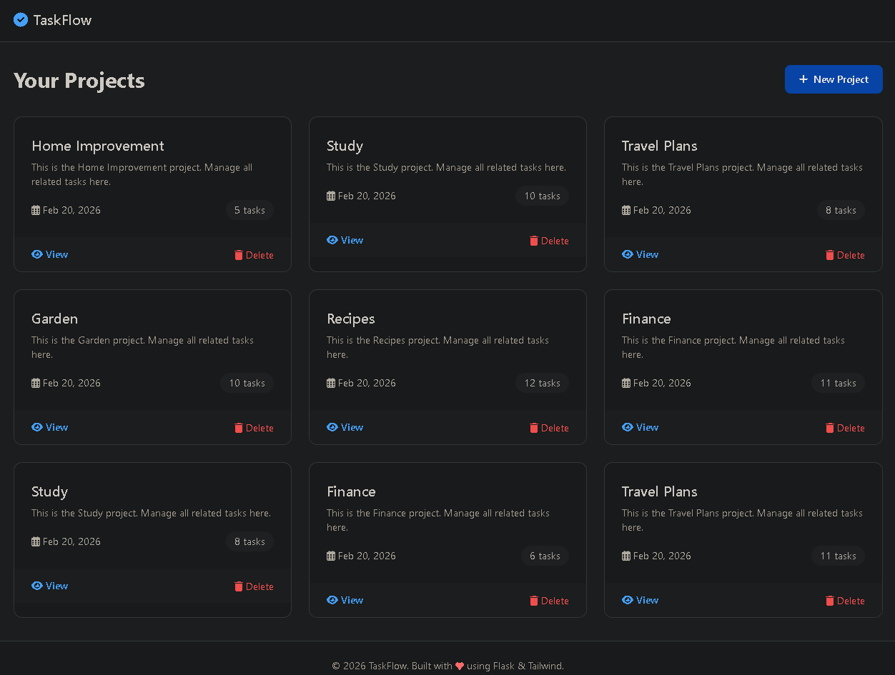

# TaskMaster – Flask Todo App

A modern, Kanban‑style task manager built with Flask, Tailwind CSS, and SQLite.



## Features
- Projects / boards
- Tasks with title, description, priority, due date
- Drag‑free status change (buttons)
- Responsive, clean UI

## Quick start
```bash
# 1. Create virtual environment
python -m venv venv
source venv/Scripts/activate   # Git Bash / Windows
# or source venv/bin/activate (Mac/Linux)

# 2. Install dependencies
pip install -r requirements.txt

# 3. Initialize database
python init_db.py

# 4. Run the app
flask run
# or python app.py
```

Then open http://127.0.0.1:5000
